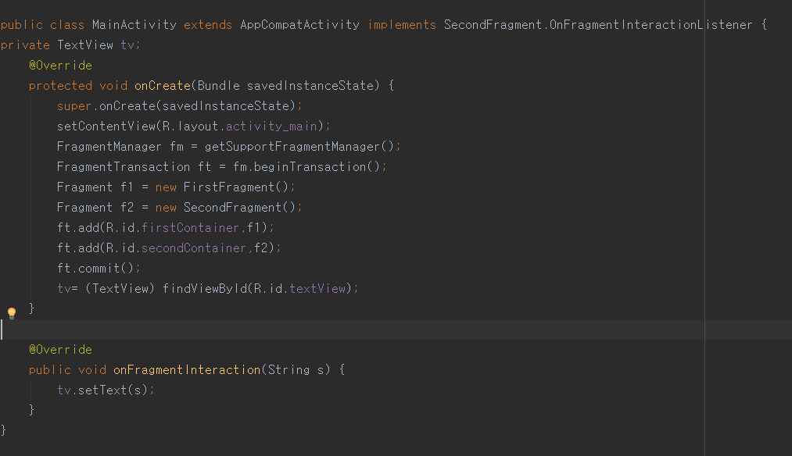
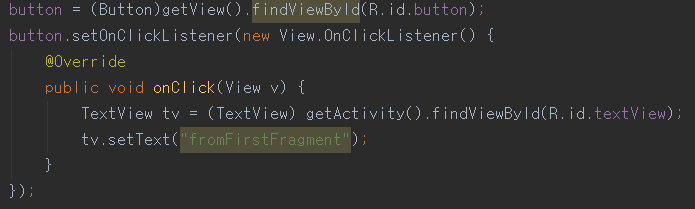
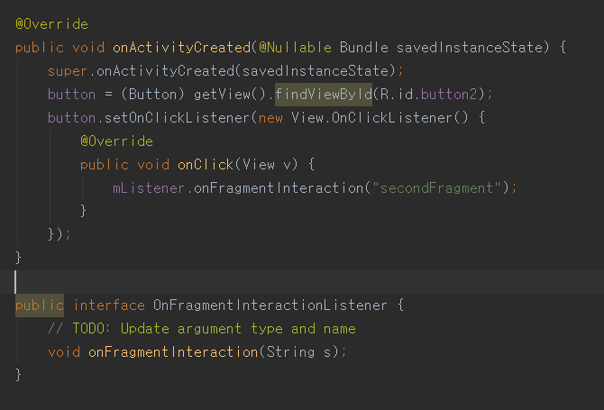
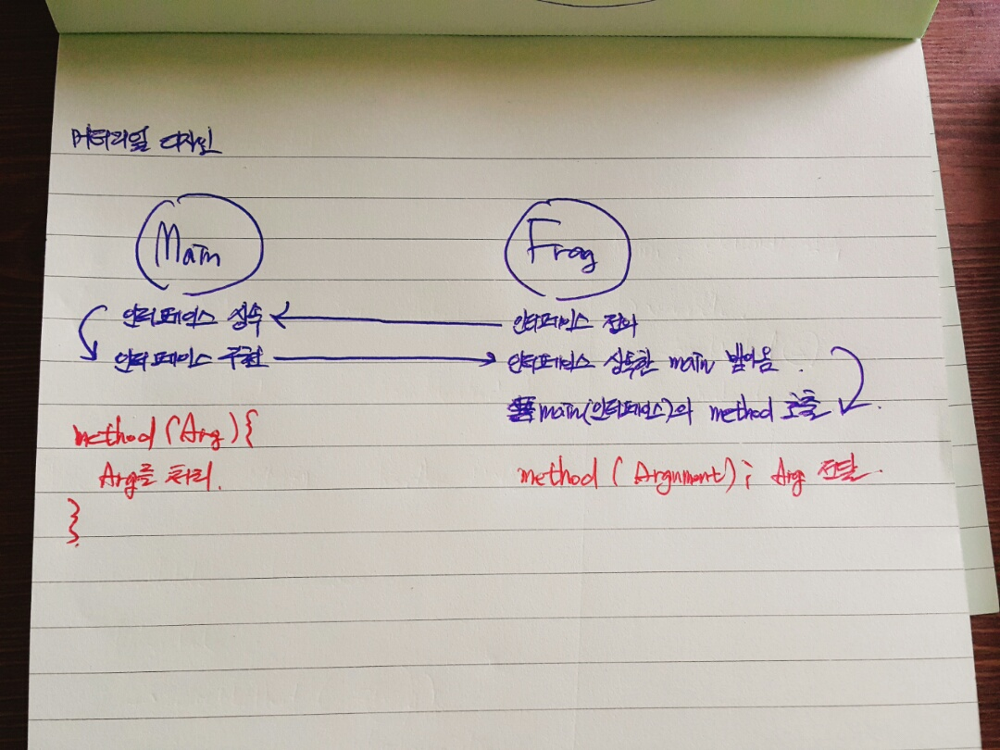

#03. 툴바와 프래그먼트 그리고 머티리얼디자인 살펴보기

- 툴바는 **액션바를 일반화**하여 앱 레이아웃 내부에서 사용할 수 있도록 만든 것이다. 액션바는 액티비티의 창을 장식하는 컨트롤 장치중 하나지만 툴바는 **여러 용도로 뷰 내부에 존재**할 수 있다.

**툴바의 특징**
>- **네비게이션** 버튼을 손쉽게 넣을 수 있다. (햄버거 아이콘)
- 브랜드 **로고** 이미지를 넣어줄 수 있다.
- **제목 및 부제목**를 표시해줄 수 있다.
- 하나 이상의 **커스텀 뷰**로 구성할 수 있다.
- 액션 **메뉴**를 붙여줄 수 있다.

-  툴바 생성

```
<application
    android:theme="@style/Theme.AppCompat.Light.NoActionBar"
    />
```
```
@Override
protected void onCreate(Bundle savedInstanceState) {
    super.onCreate(savedInstanceState);
    setContentView(R.layout.activity_main);
    Toolbar toolbar = (Toolbar)findViewById(R.id.tool_bar);
    setSupportActionBar(toolbar);
}
```


**스크롤시 앱바 숨기기**

```
<!--숨길 툴바 속성-->
app:layout_scrollFlags="scroll|enterAlways"
<!--위치가 함께 옮겨질 뷰의 속성-->
app:layout_behavior="android.support.design.widget.AppBarLayout$ScrollingViewBehavior"
```
>반드시 CoordinatorLayout안에 툴바와 옮겨질 뷰가 들어가 있어야 한다!


**프래그먼트 관리 방법**

>액티비티 내에 존재하는 프래그먼트를 가져오려면 FragmentManager를 받아와서 findFragmentById() 메소드 또는 findFragmentByTag()를 호출하면 된다.
FragmentManager의 popBackStack() 메소드를 사용하여 프래그먼트를 백 스택에서 꺼낼 수 있다.
백 스택이 변경되었는지를 감지하기 위해서 addOnBackStackChangedListner() 메소드로 리스너를 등록한다.

activity에서 fragmentTransaction(commit이 쌓임)을 이용해 fragment관리를 할수있다 (stack관리)

```
//fragment to activity
View listView = getActivity().findViewById(R.id.list);

//activity to fragment
Fragment fragment = getFragmentManager().findFragmentById(R.id.fragment);
```

프래그먼트 동적생성
```
FragmentManager fragmentManager = getSupportedFragmentManager();
FragmentTransaction fragmentTransaction = fragmentManager.beginTransaction();
ExampleFragment fragment = new ExampleFragment();
fragmentTransaction.add(R.id.fragment_container, fragment);
fragmentTransaction.commit();
```
**액티비티로의 이벤트 콜백 생성 방법**
(**getActivity.methodInMain 방식** vs **interface callback 방식**)

결론 : 둘다 가능한 방법이지만, interface callback이 재사용성이 높다!



1. firstFragment는 main의 method를 직접 호출하는 방식
2. secondFragment는 interface를 이용


1. MainActivity의 특정 view나 method를 지정해주어야함.

2. 대상과 상관없이 method로 넘겨줄 인자만 설정하면,
이후 MainActivity(또는 다른 클래스)등에서 어떻게 사용할지 자유롭게 구현할수있다!


**coordinatorLayout**
CoordinatorLayout is a super-powered FrameLayout.
CoordinatorLayout is intended for two primary use cases:

1. As a top-level application decor or chrome layout
2. As a container for a specific interaction with one or more child views

```

<android.support.design.widget.CoordinatorLayout>

    <android.support.design.widget.AppBarLayout>    

        <android.support.design.widget.CollapsingToolbarLayout     
            app:layout_scrollFlags="scroll|enterAlwaysCollapsed" >

            <ImageView/>
            <android.support.v7.widget.Toolbar>             
            </android.support.v7.widget.Toolbar>

        </android.support.design.widget.CollapsingToolbarLayout>
    </android.support.design.widget.AppBarLayout>
    <android.support.v4.widget.NestedScrollView
	 app:layout_behavior=
	 "android.support.design.widget.AppBarLayout$ScrollingViewBehavior">

    </android.support.v4.widget.NestedScrollView>
</android.support.design.widget.CoordinatorLayout>

```
**CollapsingToolbarLayout**
*scrollFlags*
- scroll : 있어야 스크롤에 반응
- enterAlways : 다 올라감. 내리면 내려옴
- enterAlwaysCollapsed : 다올라감. 맨위에서 내려야 내려옴
- exitUntilCollapsed : 최소까지 올라감. 내리면 내려옴

**Toolbar**
*layout_collapseMode*

- pin : 툴바 메뉴는 고정
- parralax : 스크롤시 같이올라감. option설정가능

**NestedScrollView**
*layout_behavior* : android.support.design.widget.AppBarLayout$ScrollingViewBehavior
앱바와 연결