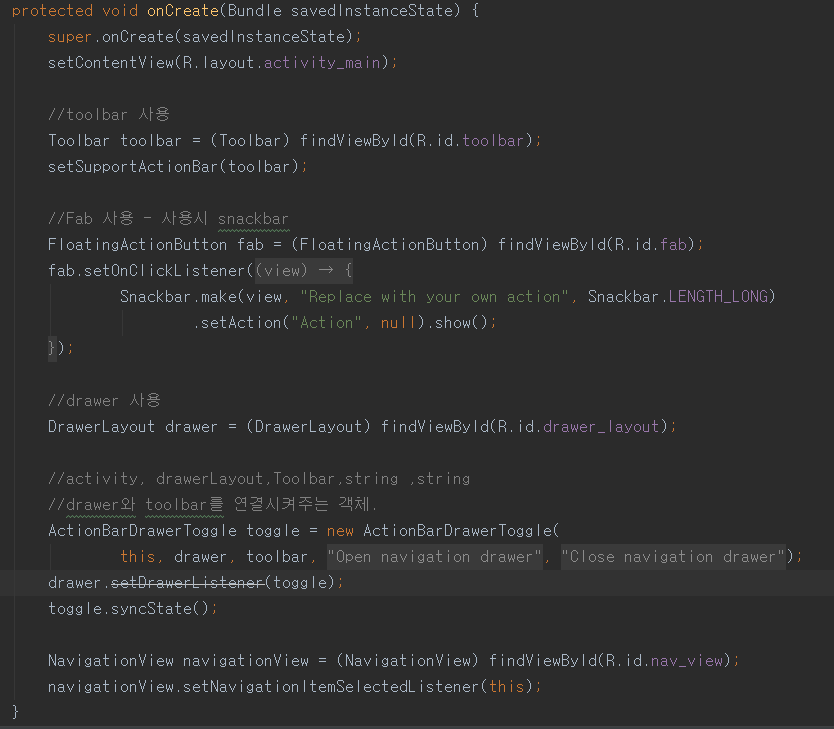
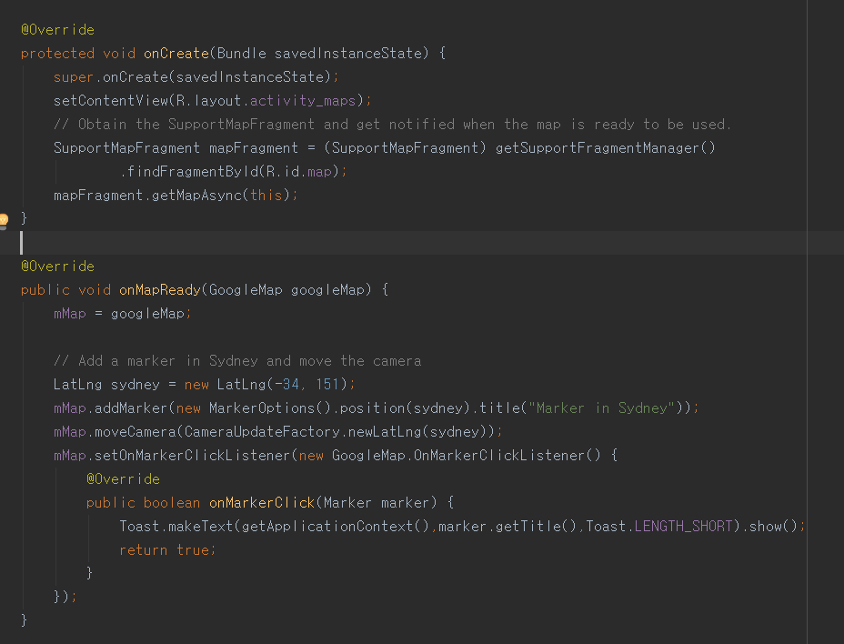

4. 안드로이드스튜디오 템플릿을 활용한 프로젝트 생성하기
==

- 네비게이션 드로어 프로젝트 생성 및 코드 분석

>1. Toolbar, Fab 설정
>2. ActionBarDrawerToggle에 DrawerLayout, Toolbar 넣어서 연결
>3. NavView에 listener설정

- 하단 네비게이션 프로젝트 생성 및 코드 분석
>BottomNavView
> +XML통해 menu item 넣어줌 
> +setOnNavigationItemSelectedListener

- 구글 맵 프로젝트 생성 및 코드 분석Navbar

>1. Resource에 API key + google play service 설치
>2. Mapfragment에서 자동 생성
>3. GoogleMap 객체 내부의 함수들로 이벤트 등 제어
>https://developers.google.com/maps/documentation/android-api/?hl=ko
